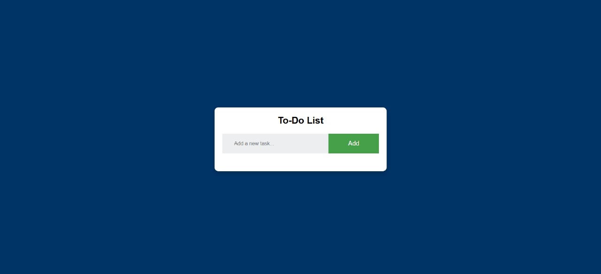
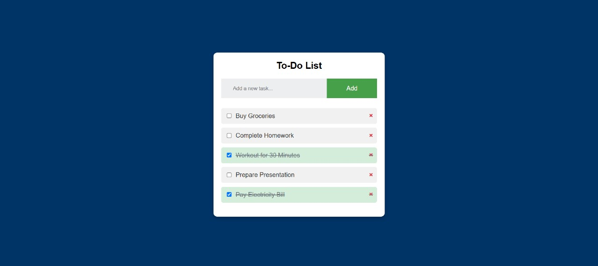

# To-Do List Application

This is a simple To-Do List application built with HTML, CSS, and JavaScript. It allows users to:
- Add tasks.
- Mark tasks as completed.
- Delete tasks.
- Save tasks locally (using `localStorage`), so they persist even after refreshing the browser.

## Features
- **Add Tasks**: Easily add tasks to your to-do list.
- **Mark as Completed**: Check off tasks to mark them as completed.
- **Delete Tasks**: Remove tasks you no longer need.
- **Persistent Storage**: Tasks are saved in the browser's localStorage.

## Screenshots

### Main Interface

### Completed and Active Tasks

## Technologies Used
- **HTML**
- **CSS**
- **JavaScript**
